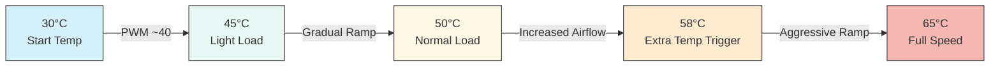
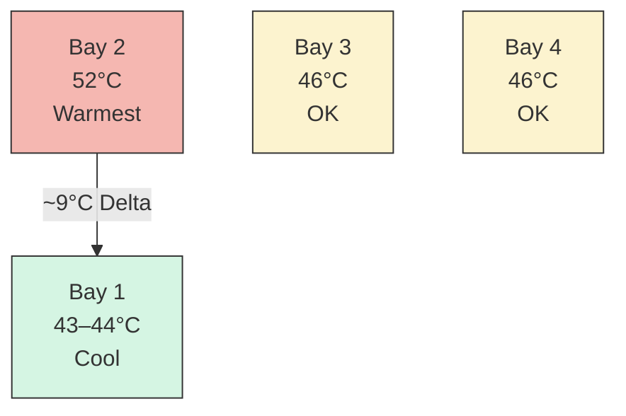
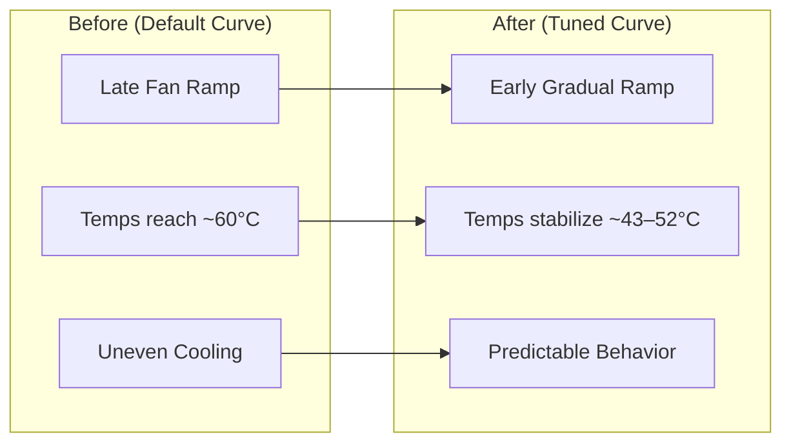

# UGREEN DXP4800+ Thermal Optimization & Fan Curve Tuning

## Overview

This repository documents the process of optimizing thermals and fan behavior on the **UGREEN DXP4800+ NAS** using AMI Aptio BIOS SmartFan controls and 4 Seagate EXOS 18TB (ST18000NM003D) enterprise drives.

### Goals

- 🔇 Barely audible at idle  
- 🌡️ Safe HDD temperatures under load  
- ⚖️ Balanced airflow across drive bays  
- 🚫 Avoid constant "full on" fan noise  

---

## Hardware

- **NAS**: UGREEN DXP4800+  
- **Drives**: 4 x Seagate EXOS 18TB (ST18000NM003D)  
- **OS**: TrueNAS SCALE 25.10.3 - Goldeye  
- **Ambient**: ~28–32°C (tropical environment)  

---

## Problem

Default fan behavior resulted in:

- One drive reaching **~60°C**  
- Others sitting around **~50°C**  
- Late fan ramping  
- Excessive noise (full fan used initially to establish baseline)  

---

## Key Insight

> Cooling capacity was never the issue — fan curve behavior was.

With fans set to full speed:
- Drives stabilized at **43–49°C**

This confirmed:
- Airflow is sufficient  
- Proper tuning is the real solution  

---

## Target Temperature Range

| Range        | Meaning              |
|--------------|----------------------|
| <45°C        | Ideal                |
| 45–50°C      | Good                 |
| 50–52°C      | Acceptable           |
| 53–55°C      | Monitor              |
| >55°C        | Avoid sustained      |

---

## Final Fan Curve (Balanced Profile)

### SYS Fan (Rear / Chassis)

```
PWM Slope: 55
Start PWM: 40–42
Start Temp: 30°C
Full Speed Temp: 65°C
Extra Temp: 58°C
Extra Slope: 80
```

---

### CPU Fan

```
PWM Slope: 35
Start PWM: 30–35
Start Temp: 40°C
Full Speed Temp: 75°C
Extra Temp: 60°C
Extra Slope: 80
```

---

## Fan Curve Behavior



---

## Results

```
Max Temp: 52°C
Min Temp: 43°C
Avg Temp: ~47°C
Delta: 7–9°C
```

---

## Drive Temperature Distribution



---

## Before vs After



---

## Thermal Monitoring Script results


System Thermal Report - 2026-04-25 22:14:31
================================================================================
BAY  DEV      MODEL                SERIAL         TEMP   STATE 
--------------------------------------------------------------------------------
2    /dev/sdb ST18000NM003D-3DL103 ZVTB17XX       53°C   WARM  
4    /dev/sdd ST18000NM003D-3DL103 ZVTBS8XX       48°C   OK    
3    /dev/sdc ST18000NM003D-3DL103 ZVTBSAXX       48°C   OK    
1    /dev/sda ST18000NM003D-3DL103 ZX3006XX       46°C   OK    
--------------------------------------------------------------------------------
Summary:
  Max Disk Temp : 53°C
  Min Disk Temp : 46°C
  Avg Disk Temp : 48.8°C
  Delta         : 7°C
================================================================================

## Notes on Temperature Delta

A 7–9°C delta between drives is normal and typically caused by:

- Airflow path  
- Drive bay placement  
- Internal chassis layout  

Optional:
- Swap drives to confirm behavior  
- Place less critical disks in hotter bays  

---

## Common Mistakes

- Setting full speed temp too low (constant fan spikes)  
- High start PWM (always noisy)  
- Low slope (slow thermal response)  
- Over-focusing on CPU fan instead of SYS fan  

---

## Key Takeaways

- SYS fan controls disk cooling  
- Prevent heat buildup instead of reacting to it  
- Small PWM changes have large real-world effects  
- Airflow design matters as much as fan curve  

---

## Credits

Inspired by: https://github.com/andrewle8/ugreen-dxp4800-thermal-fix

---

## Disclaimer - Use this information at your own risk and always monitor temperatures after applying changes.
