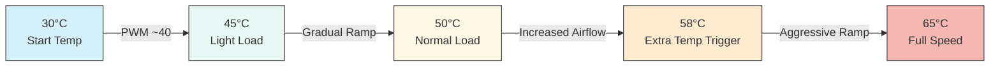
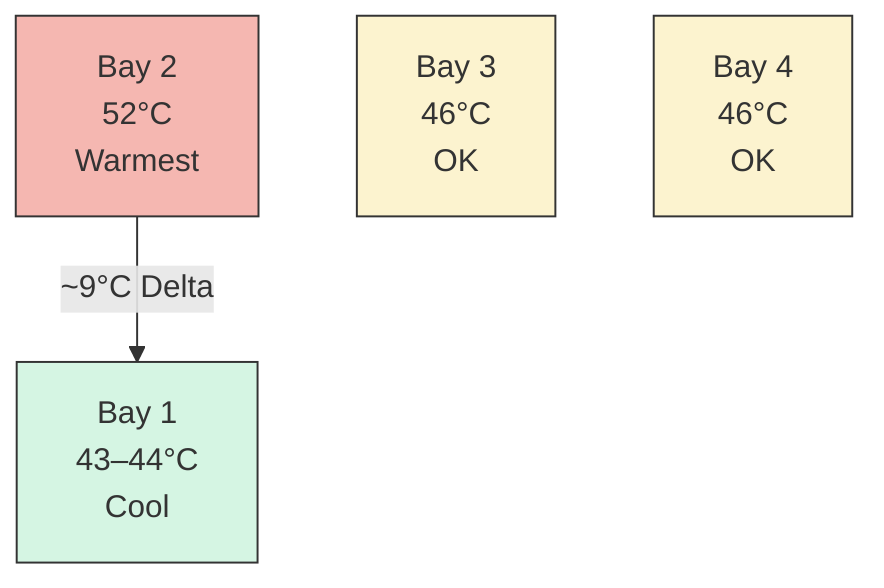
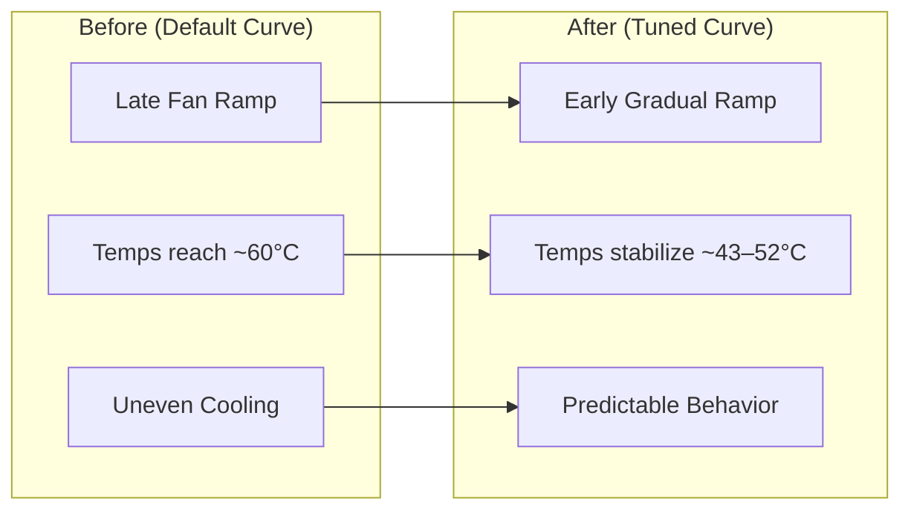

# UGREEN DXP4800+ Thermal Fan Curve

## Overview

# UGREEN DXP4800+ Thermal Optimization & Fan Curve Tuning
Fix high drive temperatures (55–60°C) on the UGREEN DXP4800+ NAS by tuning BIOS SmartFan curves for TrueNAS deployments using Seagate EXOS drives.
This guide provides reproducible results for reducing temperatures to ~43–52°C while maintaining low noise.

The following documents the process of optimizing thermals and fan behavior on the **UGREEN DXP4800+ NAS** using AMI Aptio BIOS SmartFan controls when using 4 Seagate EXOS 18TB (ST18000NM003D) enterprise drives. I absolutely love these drives, but they run warm in my current setup. Additionally, the default AMI BIOS settings were of no help and resulted in

- Fan never engaging or very late ramping
- One drive consitently reaching **~60°C**  
- Others sitting around **~50°C**  

## Tuning Approach

All results are based on:

- Controlled ambient environment (~28–32°C)
- Identical enterprise drives across all bays
- BIOS-level fan control (no OS interference)
- Repeatable measurement using SMART telemetry

### Objective
Arrive at a fan curve that -

- 🔇 Ensures the fan is barely audible at idle  
- 🌡️ Maintains safe HDD temperatures under load  
- ⚖️ Balances airflow across drive bays  
- 🚫 Avoid constant "full on" fan noise
- 🔁 Reproducible results tjat are useful for NAS deployments

---

## Hardware

- **NAS**: UGREEN DXP4800+  
- **Drives**: 4 x Seagate EXOS 18TB (ST18000NM003D)  
- **OS**: TrueNAS SCALE 25.10.3 - Goldeye  
- **Ambient**: ~28–32°C (tropical environment)  

---

## Key Insight

> Cooling capacity was never the issue — fan curve behavior was.

With fans set to "full on" speed drive temperatures stabilized at **43–49°C**

This confirmed:
- Airflow is sufficient  
- Proper tuning is the real solution  

bearing in mind

## Target Temperature Range

| Range        | Meaning              |
|--------------|----------------------|
| <45°C        | Ideal                |
| 45–50°C      | Good                 |
| 50–52°C      | Acceptable           |
| 53–55°C      | Monitor              |
| >55°C        | Avoid sustained      |

---

## Final Fan Curve (Balanced Profile)

### SYS Fan BIOS settings

```
PWM Slope: 55
Start PWM: 40–42
Start Temp: 30°C
Full Speed Temp: 65°C
Extra Temp: 58°C
Extra Slope: 80
```

---

## Fan Curve Behavior



---

## Results

```
Max Temp: 52°C
Min Temp: 43°C
Avg Temp: ~47°C
Delta: 7–9°C
```

---

## Drive Temperature Distribution



---

## Before vs After



---

## Key Takeaways

- Avoid running SYS fan at "full on" mode
- Avoid high start PWM - drives will always be theri coolest, but it will be noisy.
- Low slope **will** result in slow thermal response
- SYS fan BIOS setting effects disk cooling - don't obsess w/ CPU fan settings
- Prevent heat buildup instead of reacting to it  
- Small PWM changes have large real-world effects  
- Airflow design matters as much as fan curve
- Remember to check fan shroud and to clear dust **and** remove residual packing materials if present - :)

---

## Credits
Inspired by: https://github.com/andrewle8/ugreen-dxp4800-thermal-fix

---

## About

I work extensively with infrastructure, cloud, cybersecurity, networking, and systems design, and maintain a strong interest in practical, real-world hardware optimization.
This repository is part of a broader effort to document and share reproducible improvements for homelab and prosumer environments.


## Disclaimer - Use this information at your own risk and always monitor temperatures after applying changes.
