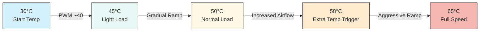
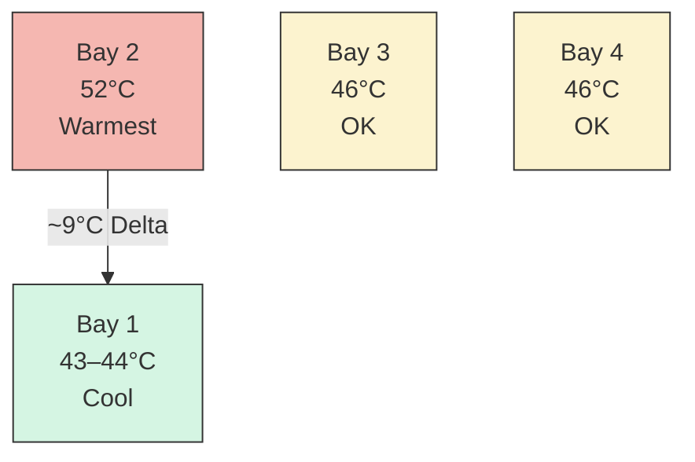
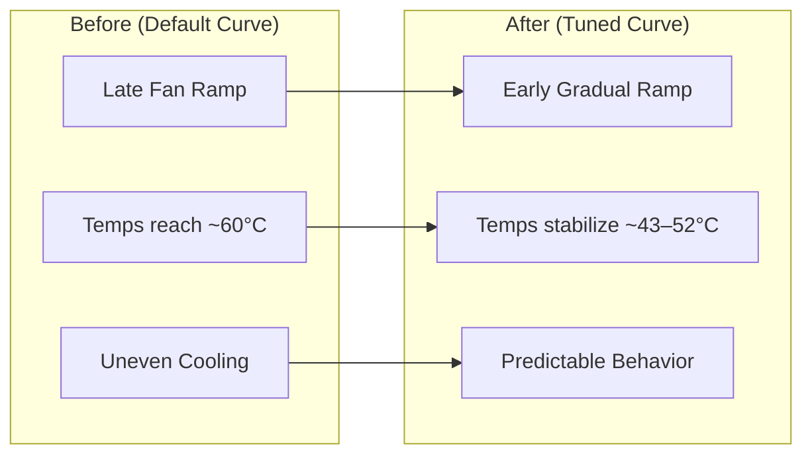

# UGREEN DXP4800+ Thermal Optimization & Fan Curve Tuning

## Overview
Fix high drive temperatures (55–60°C) on the UGREEN DXP4800+ NAS when using Seagate EXOS drives by tuning BIOS SmartFan curves. The following documents the process of optimizing thermals and fan behavior on the **UGREEN DXP4800+ NAS** using AMI Aptio BIOS SmartFan controls when using 4 Seagate EXOS 18TB (ST18000NM003D) enterprise drives spinning at 7200 RPM. I absolutely love these drives, but they were running very warm in my current setup. Additionally, the default AMI BIOS settings were of no help and resulted in

- SYS Fan never engaging or very late ramping
- One drive consistently reaching **~60°C**  
- Other drive temperatures sitting around **~50°C**  

Not devastating temperatures for these drives, but not ideal over time.

## Tuning Approach

All results are based on:

- Controlled ambient environment (~28–32°C)
- Identical new Seagate EXOS 18TB (ST18000NM003D) drives in all bays
- BIOS-level fan control (no OS interference)
- Repeatable measurement using SMART telemetry

### Objective
Arrive at a fan curve that -

- 🔇 Ensures the fan is barely audible at idle  
- 🌡️ Maintains safe HDD temperatures under load  
- ⚖️ Balances airflow across all drive bays  
- 🚫 Avoid constant "full on" fan noise
- 🔁 Reproducible results that are useful for NAS deployments

---

## Setup

- **NAS**: UGREEN DXP4800+  
- **Drives**: 4 x Seagate EXOS 18TB (ST18000NM003D)  
- **OS**: TrueNAS SCALE 25.10.3 - Goldeye  
- **Ambient**: ~28–32°C (tropical environment)  

---

## Key Insight

> Cooling capacity was never the issue — fan curve behavior was.
With SYS fan speed set to "full on" speed drive temperatures stabilized at **43–49°C** - however, this resulted in constant, very audible fan noise

This confirmed:
- Airflow sufficient  
- Proper tuning is the real solution  

## Target Temperature Range

| Range        | Meaning              |
|--------------|----------------------|
| <45°C        | Ideal                |
| 45–50°C      | Good                 |
| 50–52°C      | Acceptable           |
| 53–55°C      | Monitor              |
| >55°C        | Avoid sustained      |

---

## Final Fan Curve (Balanced Profile)

### SYS SmartFan1 BIOS settings

```
PWM Slope: 55
Start PWM: 40–42
Start Temp: 30°C
Full Speed Temp: 65°C
Extra Temp: 58°C
Extra Slope: 80
```

---

## Fan Curve Behavior



---

## Results

```
Max Temp: 52°C
Min Temp: 43°C
Avg Temp: ~47°C
Delta: 7–9°C
```

---

## Drive Temperature Distribution



---

## Before vs After



---

## Key Takeaways

- Avoid running SYS fan at "full on" mode
- Avoid high start PWM - drives will always be their coolest, but fan will be noisy.
- Low slope **will** result in slow thermal response
- Prevent heat buildup instead of reacting to it  
- Small PWM changes have large real-world effects  
- Airflow design matters as much as fan curve
- Remember to check fan shroud, clear any accumulated dust **and** to remove residual packing materials if present - doh!  :)

## Final Findings

After iterative testing across multiple scenarios (fan curve tuning, drive position swapping, airflow adjustments), the following conclusions were reached:

### 1. Fan Curve Tuning Solves the Primary Issue

The default BIOS configuration allowed drive temperatures to reach ~55–60°C due to delayed fan response.

Tuning the SYS fan curve resulted in:

- Stable operating range of ~48–52°C under typical conditions
- Predictable and smooth fan ramp behavior
- Significant reduction in unnecessary noise

---

### 2. Drive-to-Drive Thermal Variance Exists

One drive consistently ran warmer during initial testing. After swapping drive bays:

- The temperature difference followed the drive
- SMART data confirmed no hardware issues

Conclusion:

> Identical enterprise drives can exhibit small thermal differences (~2–4°C) under load.

---

### 3. Airflow Helps, But Is Not the Primary Limiter

Positioning the NAS under a ceiling fan improved temperature consistency and reduced deltas between drives.

However, once airflow was sufficient:

> Additional airflow provided diminishing returns.

---

### 4. Ambient Temperature Is the Dominant Factor

The most significant finding was the impact of room temperature.

Under cooler ambient conditions:

```

Max Temp: 46°C
Min Temp: 44°C
Avg Temp: ~44.8°C
Delta: 2°C

```

Compared to warmer conditions (~30–32°C ambient):

```

 Max Temp: 51°C
 Min Temp: 45°C
 Avg Temp: 47.5°C
 Delta: 6°C


```

This represents a **~4–6°C reduction** driven purely by environmental temperature.

---

### Key Insight

> Once airflow and fan curves are properly tuned, NAS drive temperatures are primarily governed by ambient room temperature.

---

## Final Recommendation

For optimal results:

1. Tune the fan curve to ensure early and gradual airflow ramp-up  
2. Ensure unobstructed intake and exhaust airflow  
3. Maintain reasonable ambient room temperature where possible  

After these are addressed:

> Further tuning yields minimal gains compared to environmental factors.

---

## Closing Thoughts

This exercise demonstrates that effective NAS thermal management is not solely a function of fan configuration or hardware design.

A balanced system requires:

- Proper fan curve tuning  
- Adequate airflow  
- Awareness of environmental conditions  

With all three aligned, the UGREEN DXP4800+ w/ enterprise grade large drives is capable of maintaining:

- Low noise levels  
- Stable thermals  
- Even temperature distribution across drives  

---

## Credits
Inspired by: https://github.com/andrewle8/ugreen-dxp4800-thermal-fix

---

## About

I work extensively with infrastructure, cloud, cybersecurity, networking, and systems design, and maintain a strong interest in practical, real-world hardware optimization.  This repository is part of a broader effort to document and share reproducible improvements for homelab and prosumer environments.

## Disclaimer - Use this information at your own risk and always monitor temperatures after applying changes.