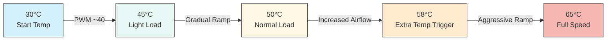
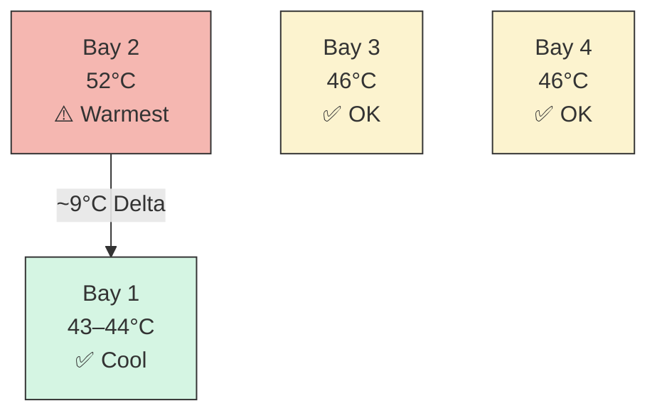
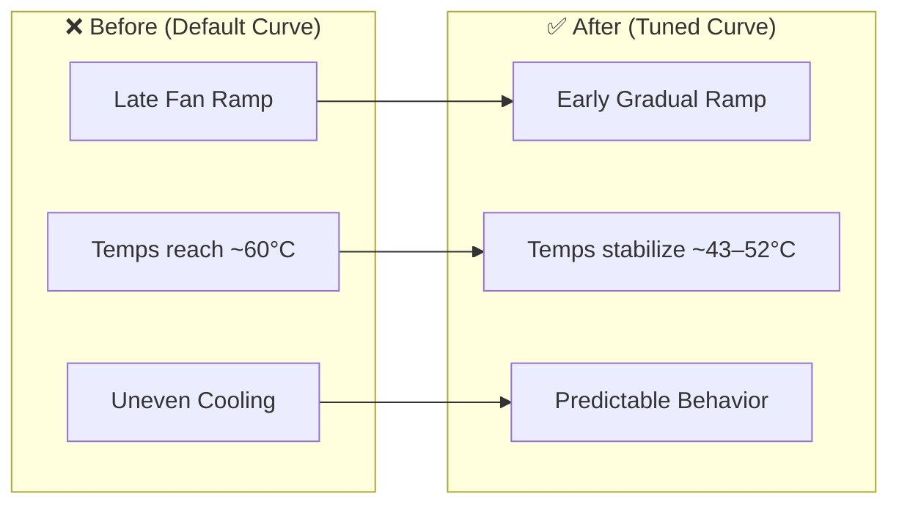

# UGREEN DXP4800+ Thermal Optimization & Fan Curve Tuning
 
> Reduce high drive temperatures (55–60°C) on the UGREEN DXP4800+ NAS by tuning BIOS SmartFan curves for TrueNAS deployments using Seagate EXOS drives. Reproducible results achieving ~43–52°C while maintaining low noise.
 


 
---
 
## ⚠️ Disclaimer
 
**Use this information at your own risk.**  
Always monitor temperatures after applying any changes. BIOS modifications vary by firmware version and hardware revision. What works in this environment may behave differently in yours. No responsibility is accepted for data loss, hardware damage, or voided warranties.
 
---
 
## Table of Contents
 
- [Overview](#overview)
- [Setup](#setup)
- [Key Insight](#key-insight)
- [Tuning Approach](#tuning-approach)
- [Target Temperature Range](#target-temperature-range)
- [Final Fan Curve Settings](#final-fan-curve-settings)
- [Fan Curve Behavior](#fan-curve-behavior)
- [Results](#results)
- [Drive Temperature Distribution](#drive-temperature-distribution)
- [Before vs After](#before-vs-after)
- [Final Findings](#final-findings)
- [Key Takeaways](#key-takeaways)
- [Final Recommendation](#final-recommendation)
- [Scripts](#scripts)
- [Closing Thoughts](#closing-thoughts)
- [Credits](#credits)
- [About](#about)
---
 
## Overview
 
The UGREEN DXP4800+ ships with default AMI Aptio BIOS SmartFan settings that are poorly calibrated for enterprise-grade spinning drives. When running 4 × Seagate EXOS 18TB (ST18000NM003D) drives at 7200 RPM, the default configuration resulted in:
 
- SYS fan never engaging or ramping very late
- One drive consistently reaching **~60°C**
- Other drives sitting at **~50°C**
These temperatures are within spec for EXOS drives but are not ideal for sustained long-term operation. This guide documents an iterative BIOS-level tuning process that resolved the issue without OS-level intervention.
 
---
 
## Setup
 
| Component | Detail |
|-----------|--------|
| **NAS** | UGREEN DXP4800+ |
| **Drives** | 4 × Seagate EXOS 18TB (ST18000NM003D) |
| **OS** | TrueNAS SCALE 25.10.3 — Goldeye |
| **BIOS** | AMI Aptio SmartFan |
| **Ambient** | ~28–32°C (tropical environment) |
 
---
 
## Key Insight
 
> Cooling capacity was never the issue — fan curve behavior was.
 
With SYS fan forced to full speed, drive temperatures stabilized at **43–49°C** — confirming that airflow was sufficient. The problem was purely the default fan curve delaying ramp-up until temperatures were already elevated.
 
---
 
## Tuning Approach
 
All results are based on:
 
- Controlled ambient environment (~28–32°C)
- Identical new Seagate EXOS 18TB drives in all four bays
- BIOS-level fan control only — no OS interference
- Repeatable measurement using SMART telemetry
### Objective
 
Arrive at a fan curve that:
 
- 🔇 Keeps the fan barely audible at idle
- 🌡️ Maintains safe HDD temperatures under load
- ⚖️ Balances airflow across all drive bays
- 🚫 Avoids constant full-speed fan noise
- 🔁 Produces reproducible results for NAS deployments
---
 
## Target Temperature Range
 
| Range | Status |
|-------|--------|
| < 45°C | ✅ Ideal |
| 45–50°C | ✅ Good |
| 50–52°C | ⚠️ Acceptable |
| 53–55°C | ⚠️ Monitor |
| > 55°C | ❌ Avoid sustained |
 
---
 
## Final Fan Curve Settings
 
### SYS SmartFan1 — BIOS Configuration
 
| Parameter | Value |
|-----------|-------|
| PWM Slope | 55 |
| Start PWM | 40–42 |
| Start Temp | 30°C |
| Full Speed Temp | 65°C |
| Extra Temp | 58°C |
| Extra Slope | 80 |
 
> 📸 **Note:** BIOS screenshots will be added to `docs/bios-screenshots/` in a future update. Navigate to: `Advanced → Hardware Monitor → SYS SmartFan1` in AMI Aptio BIOS.
 
---
 
## Fan Curve Behavior
 

 
---
 
## Results
 
| Metric | Value |
|--------|-------|
| Max Temp | 52°C |
| Min Temp | 43°C |
| Avg Temp | ~47°C |
| Delta | 7–9°C |
 
---
 
## Drive Temperature Distribution
 

 
Bay 2 consistently runs warmest. After swapping drives between bays, the temperature differential followed the drive — not the bay — confirming a minor unit-level thermal variance rather than an airflow issue.
 
---
 
## Before vs After
 

 
---
 
## Final Findings
 
### 1. Fan Curve Tuning Solves the Primary Issue
 
The default BIOS configuration allowed temperatures to reach ~55–60°C due to delayed fan response. After tuning:
 
- Stable operating range of ~48–52°C under typical conditions
- Predictable and smooth fan ramp behavior
- Significant reduction in unnecessary noise
### 2. Drive-to-Drive Thermal Variance Exists
 
Identical enterprise drives can exhibit small thermal differences (~2–4°C) under load. Bay-swapping confirmed this follows the drive unit, not the physical bay position.
 
### 3. Airflow Helps, But Is Not the Primary Limiter
 
Positioning the NAS under a ceiling fan improved temperature consistency. However:
 
> Once sufficient airflow is established, additional airflow yields diminishing returns.
 
### 4. Ambient Temperature Is the Dominant Factor
 
| Condition | Max | Min | Avg | Delta |
|-----------|-----|-----|-----|-------|
| Cooler ambient (~24–26°C) | 46°C | 44°C | ~44.8°C | 2°C |
| Warmer ambient (~30–32°C) | 51°C | 45°C | ~47.5°C | 6°C |
 
> Once airflow and fan curves are properly tuned, NAS drive temperatures are primarily governed by ambient room temperature.
 
---
 
## Key Takeaways
 
- ✅ Start PWM low — let the curve do the work, not the baseline
- ✅ Prevent heat buildup; don't react to it after the fact
- ✅ Small PWM slope changes have large real-world temperature effects
- ✅ Airflow design matters as much as fan curve parameters
- ❌ Avoid high Start PWM — drives will be coolest but fan noise is constant
- ❌ Avoid low slope values — thermal response becomes too slow
- ❌ Don't run SYS fan at permanent full speed
- 🧹 Check fan shroud, clear accumulated dust, and remove any residual packing materials before tuning
---
 
## Final Recommendation
 
1. Tune the fan curve for early, gradual ramp-up (Start Temp 30°C, low Start PWM)
2. Ensure unobstructed intake and exhaust airflow paths
3. Maintain a reasonable ambient room temperature where possible
After these three are addressed:
 
> Further tuning yields minimal gains compared to environmental factors.
 
---
 
## Scripts
 
### `scripts/temps.sh`
 
A shell script for monitoring drive temperatures via SMART telemetry directly from TrueNAS SCALE.
 
**Dependencies:**
- `smartctl` (included in TrueNAS SCALE by default)
- Run as `root` or with `sudo`
**Usage:**
```bash
chmod +x scripts/temps.sh
sudo ./scripts/temps.sh
```
 
**Output:** Current temperature readings for all detected drives, formatted for quick review.
 
---
 
## Closing Thoughts
 
Effective NAS thermal management is not solely a function of fan configuration or hardware design. A balanced system requires proper fan curve tuning, adequate airflow, and awareness of environmental conditions. With all three aligned, the UGREEN DXP4800+ with enterprise-grade large drives is capable of maintaining low noise levels, stable thermals, and even temperature distribution across all drive bays.
 
---
 
## Credits
 
Inspired by the original investigation at:  
[andrewle8/ugreen-dxp4800-thermal-fix](https://github.com/andrewle8/ugreen-dxp4800-thermal-fix)
 
---
 
## About
 
I work extensively with infrastructure, cloud, cybersecurity, networking, and systems design, and maintain a strong interest in practical, real-world hardware optimization. This repository is part of a broader effort to document and share reproducible improvements for homelab and prosumer environments.
 
---
 
*Contributions, corrections, and additional hardware configurations welcome via Issues or Pull Requests.*